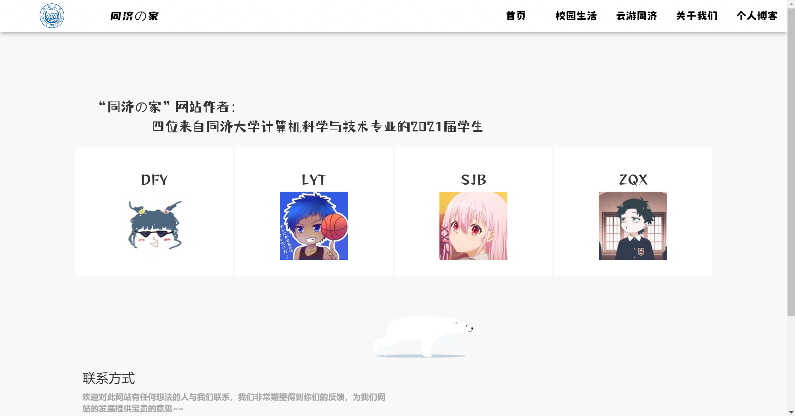
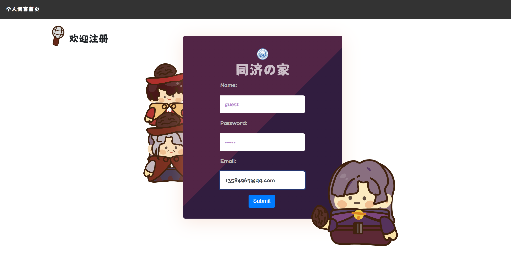

The "venv" folder within the "TongJiers' Home" directory serves as the virtual environment for running the website's source code. Prior to launching the website's main program, please ensure that all packages within the environment have been successfully installed.

To initiate the website, execute the "main.py" file located in the folder, and then open the generated domain in your web browser.

Here is the main interface display of the website.

